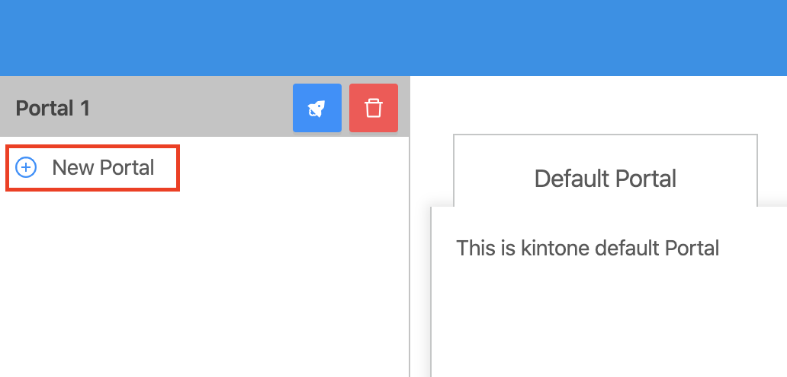
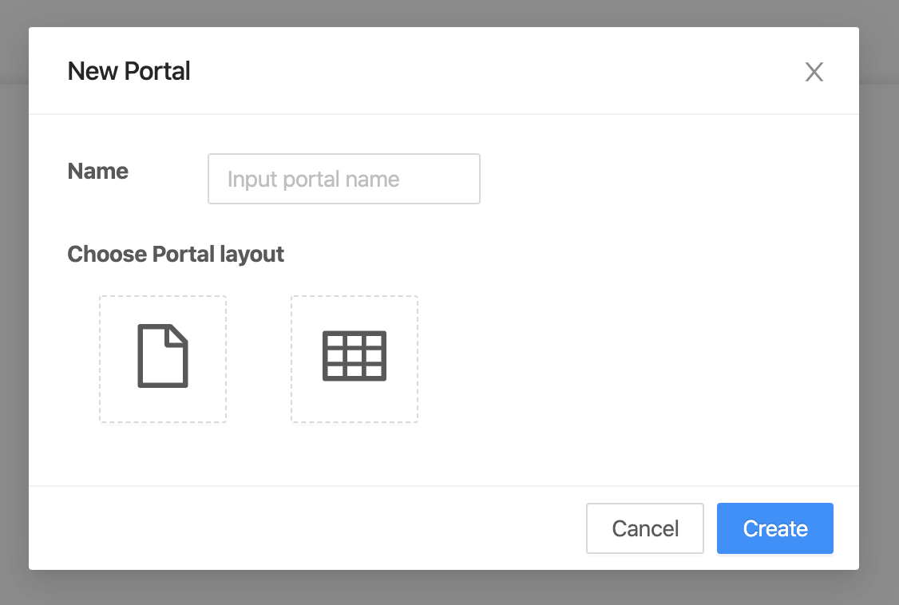
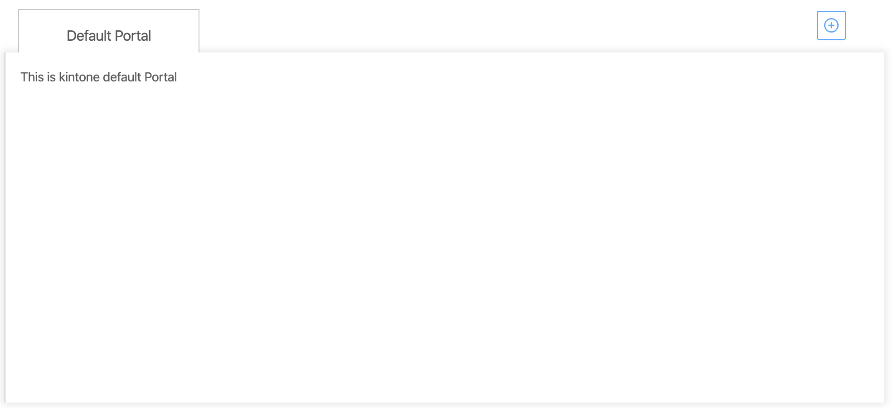
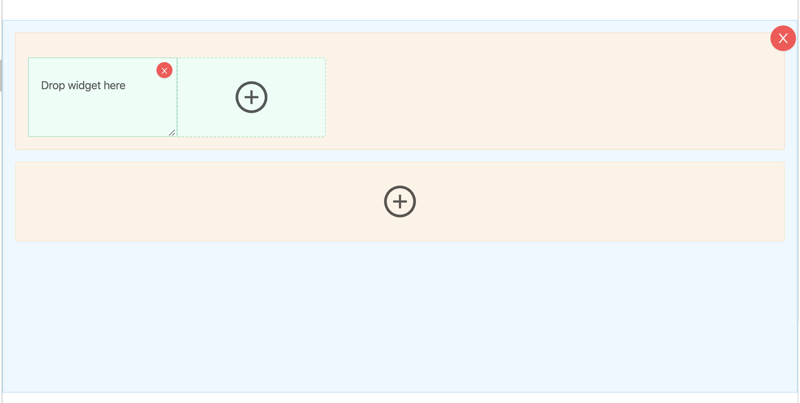
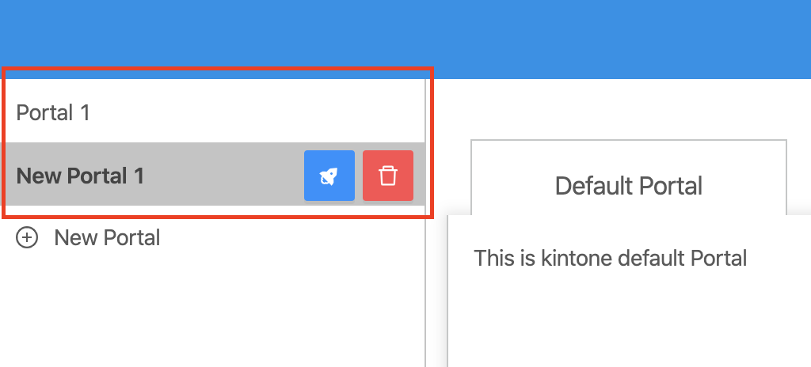

## Step 1: Openning New Portal dialog.
- Openning New Portal dialog by clicking on "New portal".

- New Portal dialog will be displayed.

## Step 2: Creating new Portal.
- Inputing name of new portal.
- Choose Portal layout:
  - Tabs layout.
  
  - Grid layout.
  
- To create new portal, click "Create" button.

:::note

- New Portal after created will be display on Portal list at left panel.

- To update Portal, please reference to [Update Portal](updatePortal).

- To delete Portal, please reference to [Delete Portal](deletePortal).

:::
