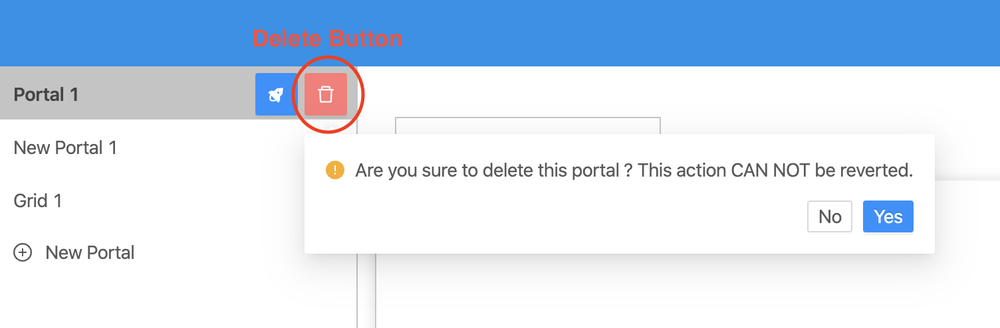

- When Delete Button clicked, a popup confirms will be displayed to remove selected portal.
- To remove selected portal, click “Yes” button.
- To cancel remove, click “No” button.

:::note

- To add new Portal, please reference to [Add new Portal](addPortal).
- To update Portal, please reference to [Update Portal](updatePortal).

:::
