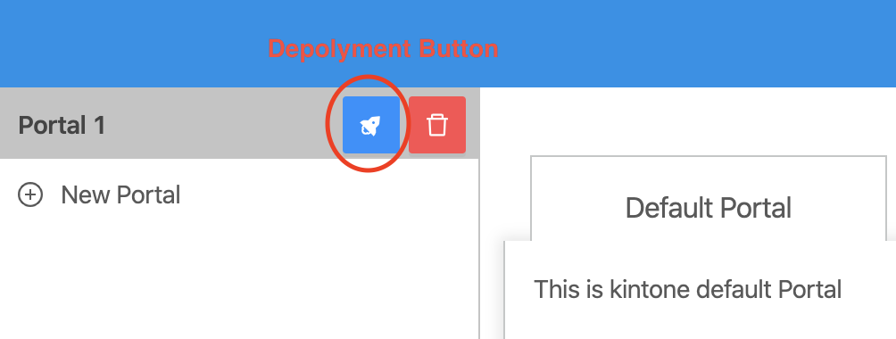
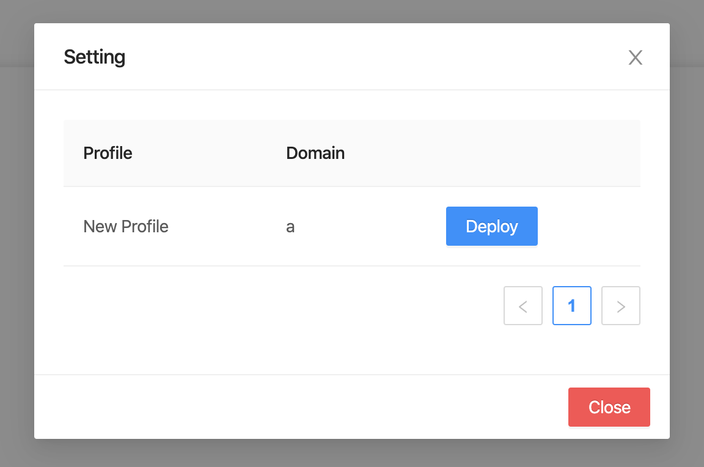

## Step 1: Openning deployment setting.
- When Deployment Button clicked, Setting dialog will be displayed.

Setting dialog

## Step 2: Deployment Portal.
After Setting dialog is displayed:
- User can select a predefined profile (Reference to [Add new Profile](../profileManagement/addProfile)).
- To deploy to kintone, clicks “Deploy” button. 
- There are 3 status: 
  - Deploy
  - Deploying
  - Done
