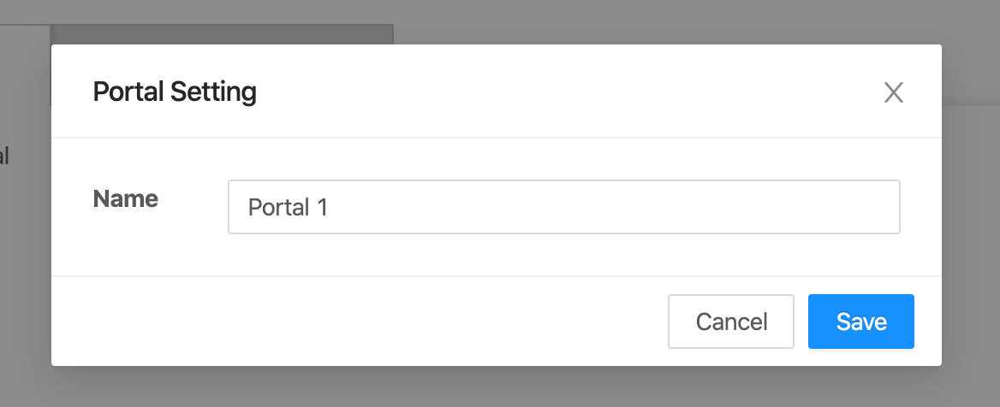

- When doubled click on portal item in Portal list, the dialog change portal name will display:

  - Input new name of the current portal.
  - To save new name, click “Save” button.
  - To cancel any change, click the close icon or “Cancel” button.

:::note

- To add new Portal, please reference to [Add new Portal](addPortal).

- To delete Portal, please reference to [Delete Portal](deletePortal).

:::
