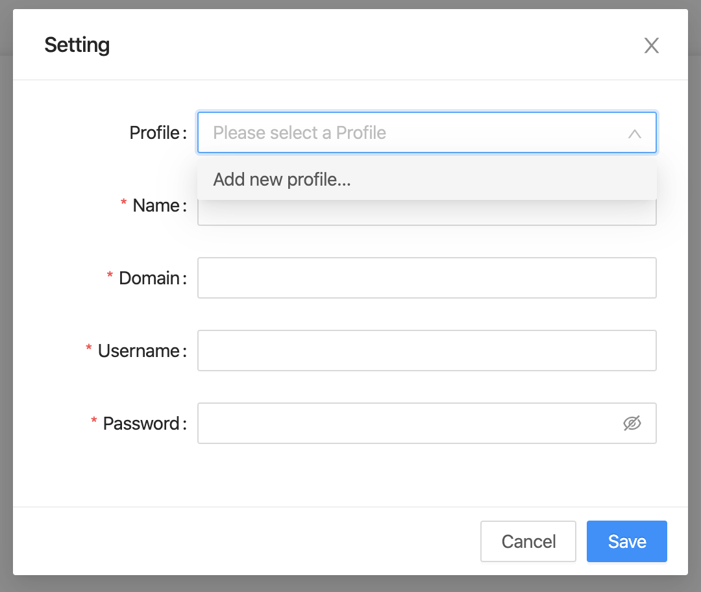

## Step 1: Opening Profile setting.
- Open setting dialog by clicking on Setting Button at top right Portal screen.

- Setting dialog will be displayed.

## Step 2: Add new Profile.
After Setting dialog is displayed:
- Clicking on Profile's dropdown and select "Add new profile...".
- Inputing information to create a profile (Name, Domain, Username, Password).
- Then click on Save button to add new profile.

:::note

- The new Profile after creating will be list on Profile's dropdown. 
- To update Profile, please reference to [Update Profile](updateProfile).
- To deploy Portal, please reference to [Deploy Portal](../portalManagement/deployPortal).

:::
