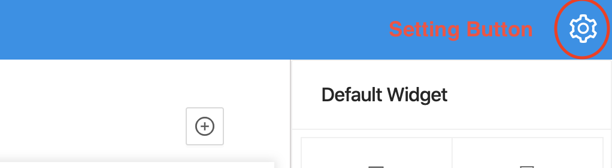

## Step 1: Opening Profile setting.
- Open setting dialog by clicking on setting icon at top right Portal screen.

- Setting dialog will be displayed.

## Step 2: Update Profile.
After Setting dialog is displayed:
- Clicking on Profile's dropdown and select a profile.
- Updating information which do you want to change.
- Then click on Save button to update profile.

:::note

- To add new Profile, please reference to [Add new Profile](addProfile).

:::