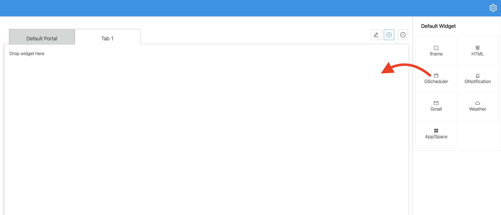
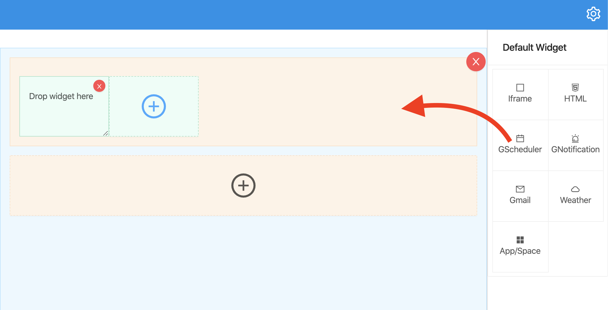
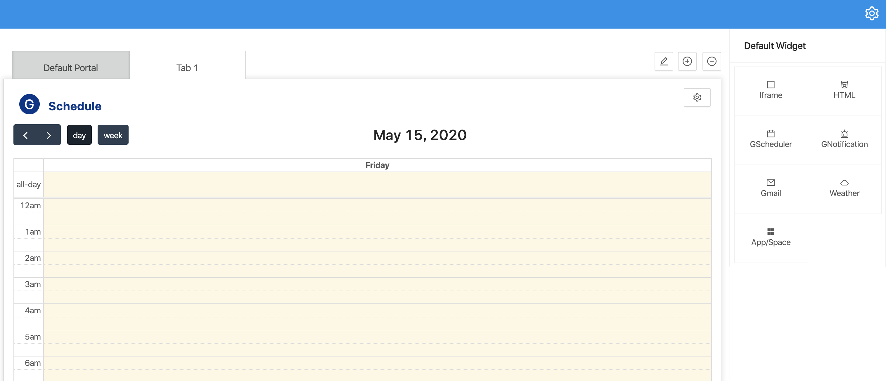
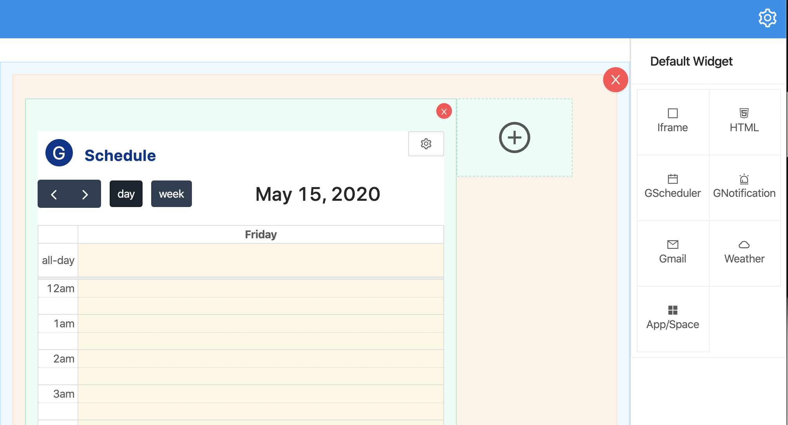

- To add a Widget, user will drag & drop a widget from Widget list to:
  - Tabs layout
  
  - Grid layout
  
- After add a Widget:
  - Tabs layout
  
  - Grid layout
  

:::note

- To config a Widget, please reference to [Widget Configuration](configWidget).
- To delete Widget, please reference to [Delete Widget](deleteWidget).

:::
