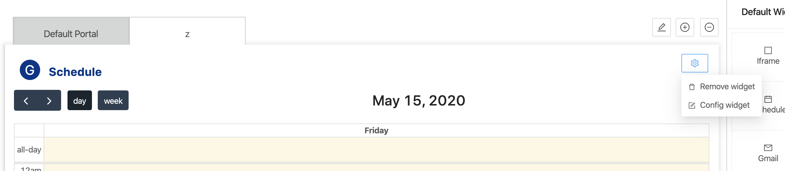
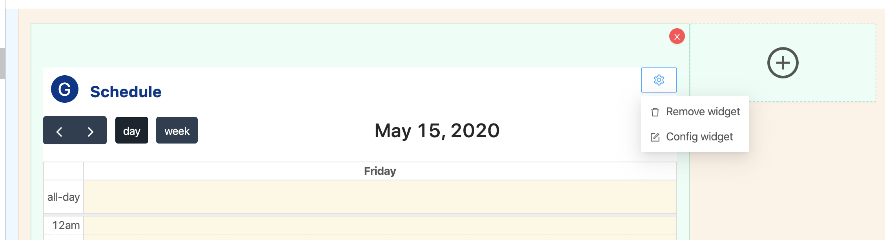

- Tabs layout:

- Grid layout:

- When Remove widget clicked, a popup confirms will be displayed to remove selected widget.
- To remove selected widget, click “Yes” button.
- To cancel remove, click “No” button.

:::note

- To add a Widget, please reference to [Add a Widget](addWidget).

:::