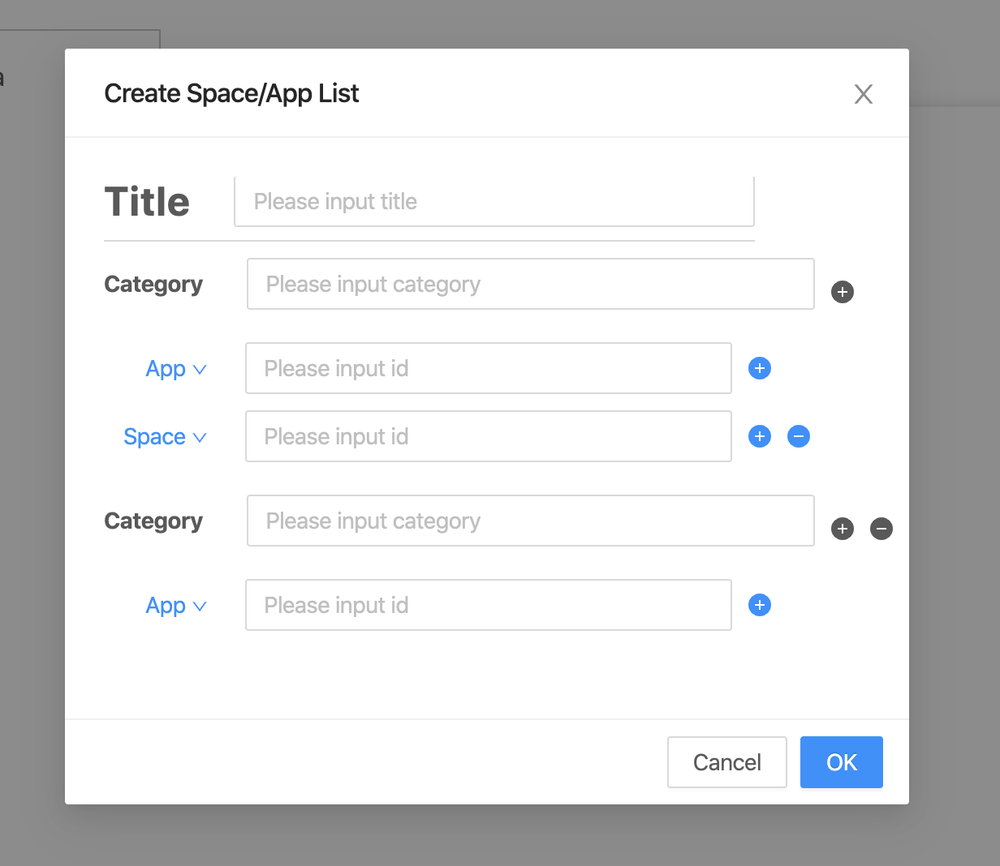
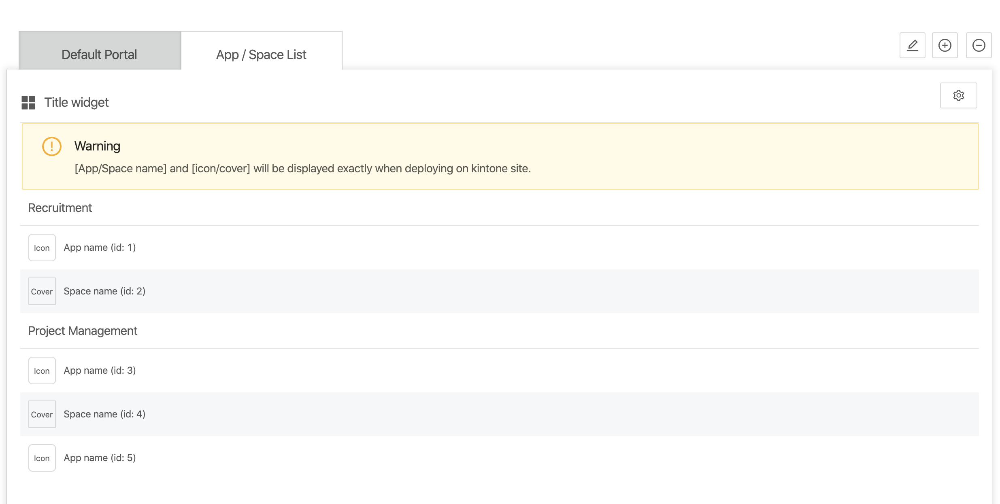
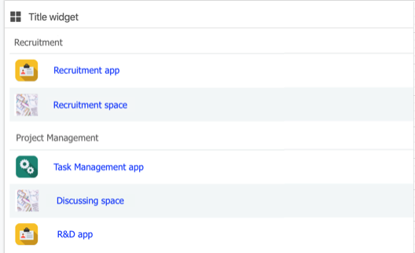

## Overviewiew
This widget support listing applications and spaces by categories.

:::note

Currently this widget doesn’t support guest space and guest app.

:::

## Add App / Space List widget
- To add App / Space List widget, please reference to [Add a Widget](../addWidget).

## Openning Config dialog
- User can open Widget config dialog by 2 ways:
  - When adding App / Space List widget.
  - When clicking on "config widget" button.
  

## Config dialog

- Title: Widget title.
- Category: User can add multiple Categories.
  - App: kintone App id. User can add multiple App id.
  - Space: kintone Space id. User can add multiple Space id.
- To save updating setting by clicking on "OK" button.
- To discard updating setting by clicking on "Cancel" button.

## Preview

## On kintone Portal

:::note

- To add a Widget, please reference to [Add a Widget](addWidget).
- To delete Widget, please reference to [Delete Widget](deleteWidget).

:::
