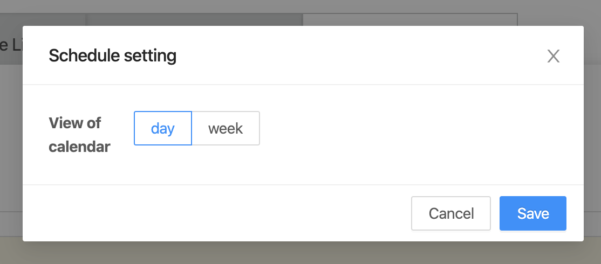
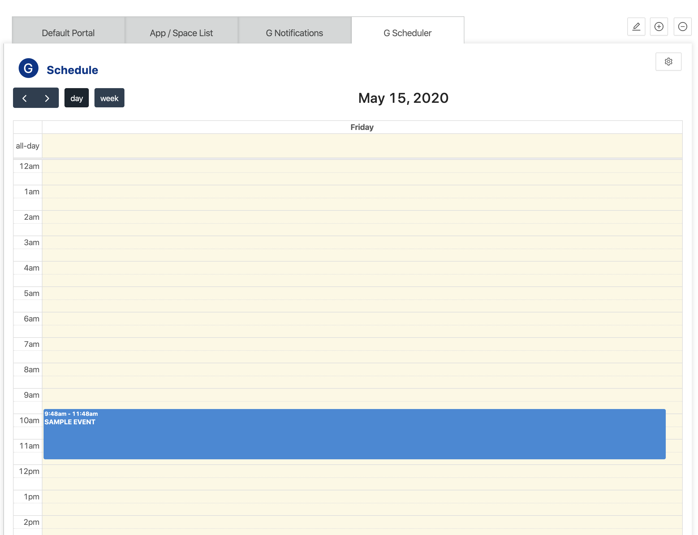

## Overview
G Scheduler Widget is a simple widget that will display a scheduler using [FullCalendar](https://fullcalendar.io).

:::note

Currently, Supported only English.

:::

## Add G Scheduler widget
- To add G Scheduler widget, please reference to [Add a Widget](../addWidget).

## Openning Config dialog
- User can open Widget config dialog by clicking on "config widget" button.
  

## Config dialog

- View of calendar: 
  - day: Day view scheduler.
  - week: Week view scheduler.
- To save updating setting by clicking on "Save" button.
- To discard updating setting by clicking on "Cancel" button.

## Preview / On kintone Portal

:::note

- To add a Widget, please reference to [Add a Widget](addWidget).
- To delete Widget, please reference to [Delete Widget](deleteWidget).

:::
