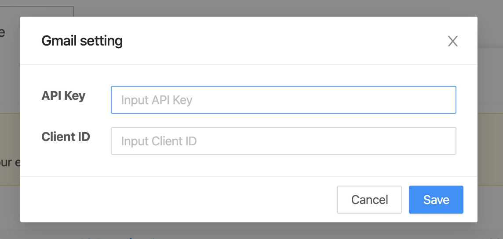
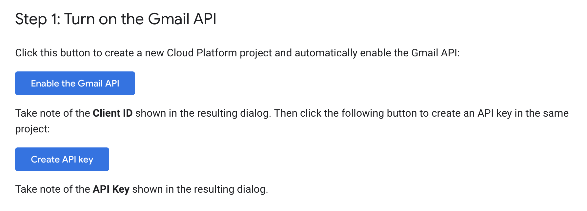
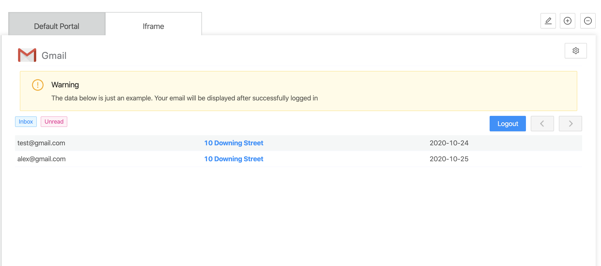

## Overview
Gmail Widget is a simple widget that will display the Gmail message.

## Add Gmail widget
- To add Gmail widget, please reference to [Add a Widget](../addWidget).

## Openning Config dialog
- User can open Widget config dialog by clicking on "config widget" button.
  

## Config dialog

- API key: Google API key.
- Client ID: Google Client ID.
- To save updating setting by clicking on "Save" button.
- To discard updating setting by clicking on "Cancel" button.

:::note

- For getting **API key** and **Client ID**:
  - Access to https://developers.google.com/gmail/api/quickstart/js#step_1_turn_on_the

  - Clicking on "Enable the Gmail API" to enable the Gmail API and get **Client ID**.
  - Clicking on "Create API key" to get **API key**.

:::

## Preview / On kintone Portal

:::note

- To add a Widget, please reference to [Add a Widget](addWidget).
- To delete Widget, please reference to [Delete Widget](deleteWidget).

:::