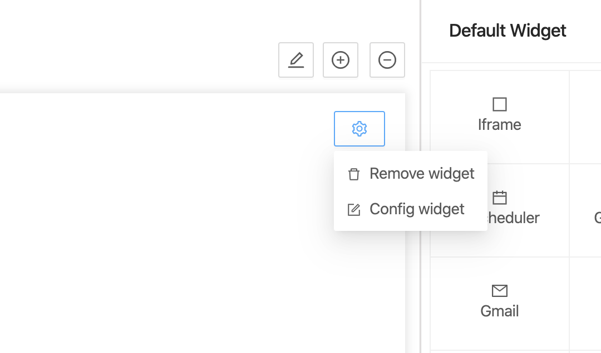
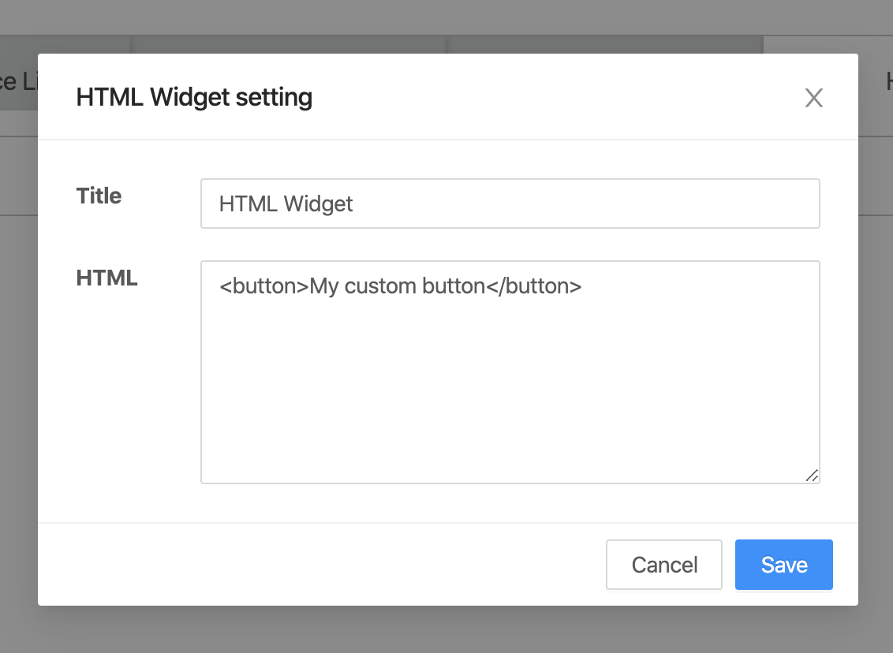
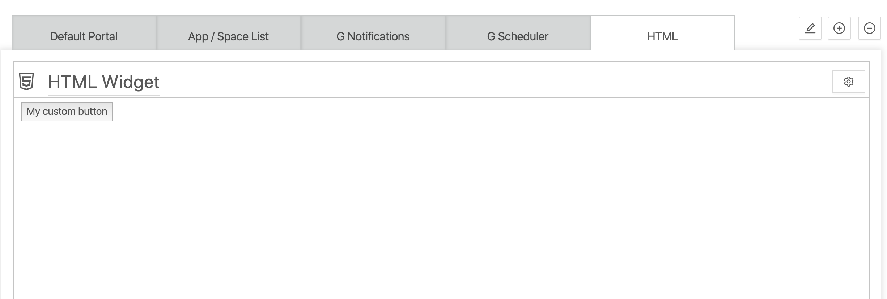

## Overview
HTML Widget is a simple widget that will display a web using HTML tag.

## Add HTML widget
- To add HTML widget, please reference to [Add a Widget](../addWidget).

## Openning Config dialog
- User can open Widget config dialog by clicking on "config widget" button.
  

## Config dialog

- Title: Widget title.
- HTML: Text area to input html.
- To save updating setting by clicking on "Save" button.
- To discard updating setting by clicking on "Cancel" button.

## Preview / On kintone Portal

:::note

- To add a Widget, please reference to [Add a Widget](addWidget).
- To delete Widget, please reference to [Delete Widget](deleteWidget).

:::
