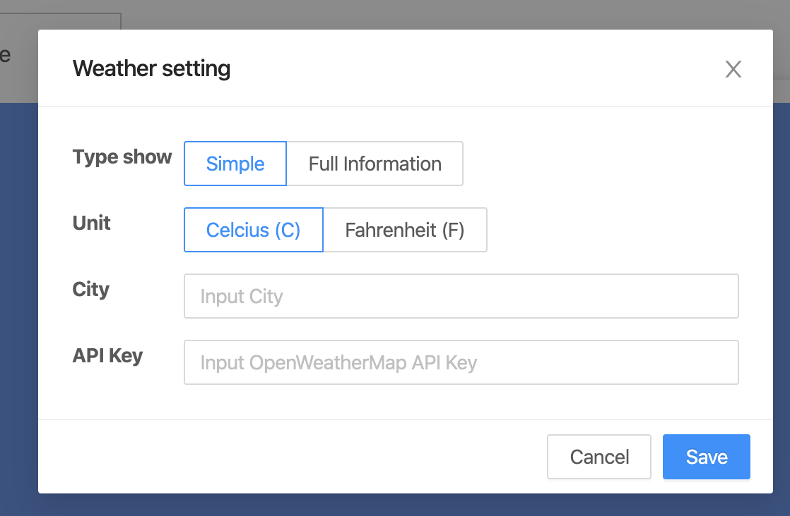
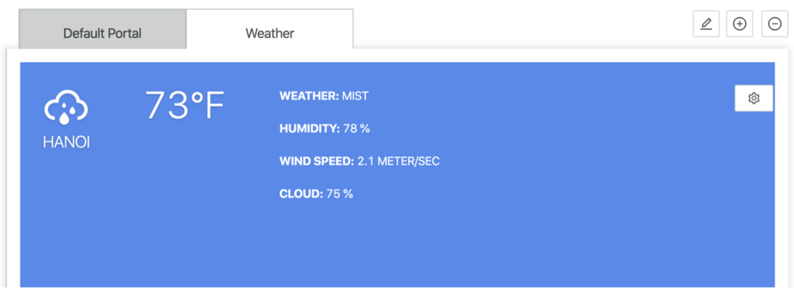

## Overview
Weather Widget is a simple widget that will display weather using [OpenWeatherMap](https://openweathermap.org) and [simple-react-weather](https://www.npmjs.com/package/simple-react-weather).

## Add Weather widget
- To add Iframe widget, please reference to [Add a Widget](../addWidget).

## Openning Config dialog
- User can open Widget config dialog by 2 ways:
  - When adding App / Space List widget.
  - When clicking on "config widget" button.
  

## Config dialog

- Type show: To select a type to show of the weather component (full or simple).
- Unit: to select a unit to temperature of the weather component (Celcius (C), Fahrenheit (F)).
- City: City to find the weather.
- API Key: API key to call API OpenWeatherMap. ([Weather API](https://openweathermap.org/api))
- To save updating setting by clicking on "Save" button.
- To discard updating setting by clicking on "Cancel" button.

## Preview / On kintone Portal

:::note

- To add a Widget, please reference to [Add a Widget](addWidget).
- To delete Widget, please reference to [Delete Widget](deleteWidget).

:::
